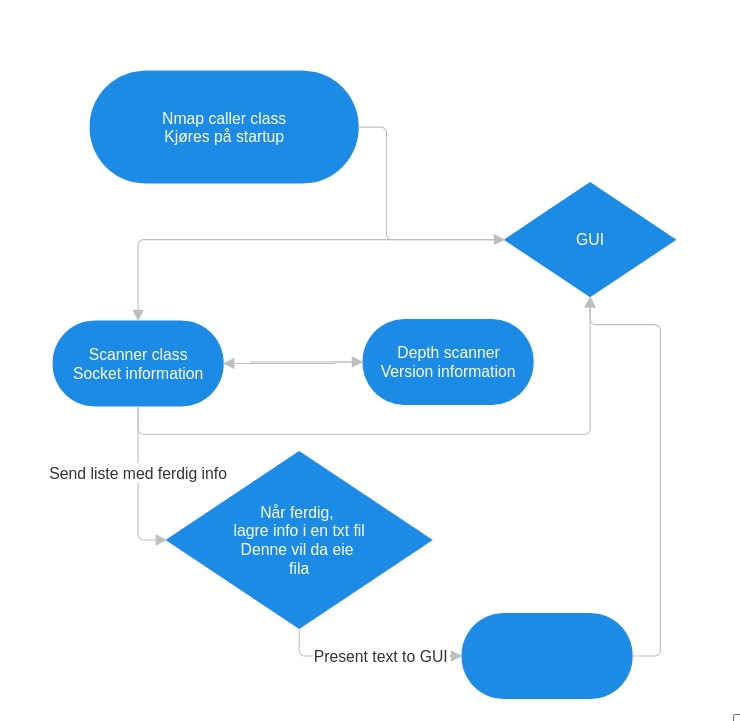

Over er en plan for hvordan jeg vil at flyten skal se ut

Oversikt om hvordan lage GUI
https://niitdigital.medium.com/how-to-create-a-gui-with-java-109f7c8252e7

1) man kaller klassen sin main method, denne blir ansvarlig for å organisere og sende informasjon til riktig plass
2) 1) Dersom man skal starte søk på ett nytt program, kjør scanner og depth, når hver av de er ferdig gå til 4
2) 2) Dersom man vil se gammel informasjon, vil man når man kjøre scanner, finne ut at den allerede er scanna, som omgår da både scanner og depth, før den parser data og viser dirkete   
4) Når programmet er ferdig søkt, skal det legge til informasjonen den har samla tidligere inn i en txt fil mye på samme måte som nmap.

For å parse og skrive denne teksten effektivt 

# Caller class
1) Opens GUI
2) allows user to write information in GUI
3) start program with submit button
4) If IP already scanned, read from file (this can lead to old results but whatever), else start the scann class and provide IPv4 and port range to check.

# Scanner class
params : IPv4 address, port range
1) attempt TCP connections (SYN) to each of the ports and log if open or closed (closed if either timeout or loss occurs)
2) If it finds and open port, send that portnumber and IPv4 address to the depth scan
3) log info to txt file

# Depth scan
1) takes in a singular port number and IPv4 address, and probes with e.g. a GET request for version information
2) Return verison to scanner

# GUI
To make it easier on ourselves, this will always be called by specifiying a IPv4 address saved, so we just specify IP, and show the corresponding section of txt file.
We will save the information as objects to make them easier to get later. 