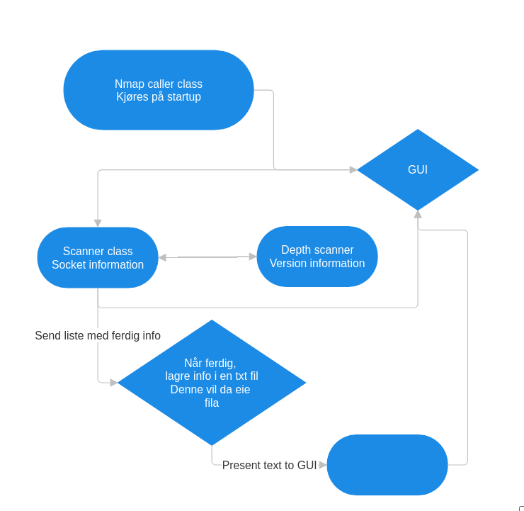

#### Beskrivelse av appen 

Appen er designed slik at en bruker kan gjennomføre ett angrep, spesifikt et port scan angrep mot en annen maskin, brukeren vil få mulgiheten til å redigere ip addresser, port range og antall threads de vil bruke (in progress) 
Ved oppstart vil grensesnittet vises, hvor brukeren kan legge inn ønsket informasjon, deretter kjøres programmet mot offeret og resultatene lagres i en json fil for senere henting av data. Dersom ett angrep blir kjørt mot samme maskin under samme port range, vil ikke en ny scan kjøres da den gamle informasjonen vil bli benyttet. Dette åpner selvfølgelig for dårlig informasjon, noe som ikke er håndtert enda. Time stamp er lagt inn i json fila, slik at en i fremtiden, kan forkaste gammel informasjon. 
Enda ett aspekt som skal utbedres er multithreading, alt er lagt opp for bruken av det, men det mp enda implementeres. 

##### Diagramm
